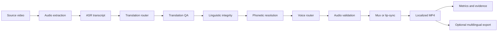
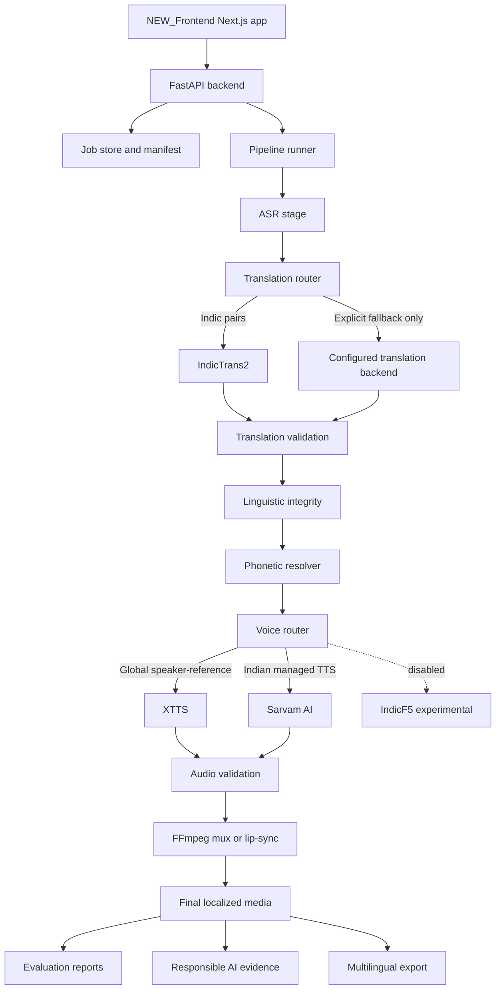

# VideoLingua - AI Video Translation, Dubbing, QA, and Export

VideoLingua is an auditable AI video localization pipeline for translating,
voicing, validating, and packaging localized video outputs. It combines a
FastAPI backend, a Next.js frontend, explicit backend routing, translation
quality checks, speech generation, media assembly, evaluation reports, and
responsible AI evidence sidecars.

The project is built around one practical goal: take a source video and produce
localized outputs whose routing, quality signals, compliance evidence, and
known limitations can be inspected instead of guessed.

## Current Status

Working paths:

- French dubbing through XTTS speaker-reference voice generation.
- Kannada dubbing through IndicTrans2 translation and Sarvam managed TTS.
- A premium Next.js frontend in `NEW_Frontend`.
- FastAPI upload, job status, pipeline, result, and static artifact serving.
- Strict translation and voice backend routing with blocked silent fallback.
- Translation QA for scripts, empty segments, numbers, entities, names,
  glossary terms, expansion pressure, punctuation, and neighboring context.
- Linguistic Integrity reports that preserve canonical translated text.
- Phonetic Resolution that prepares TTS-safe text without rewriting the
  canonical translation.
- HuBERT-guided prosody and elocution analysis.
- Automatic metrics report scaffolding for completed jobs.
- Multilingual OTT-style export from existing localized tracks.
- Responsible AI and provenance-readiness sidecars in report-only mode.

Disabled or experimental paths:

- IndicF5 is retained as disabled/local-experimental scaffolding.
- Local IndicF5 load-only validation timed out on Windows, so it is not treated
  as a working production backend.
- Indic Parler is forbidden and not used.
- Sarvam is managed Indian-language TTS, not exact speaker cloning.

## What The Pipeline Does

1. Accept a source video from the frontend or a local backend invocation.
2. Extract and normalize source audio with FFmpeg.
3. Run ASR/transcription.
4. Route translation through the configured translation router.
5. Run translation QA against text, script, segment, glossary, and context
   constraints.
6. Run the Linguistic Integrity Engine as a post-translation gate.
7. Prepare TTS-safe text through the Phonetic and Ambiguity Resolution Layer.
8. Route voice generation through XTTS, Sarvam, or an explicitly configured
   backend.
9. Validate generated audio before final assembly.
10. Mux or lip-sync the localized audio with the source video.
11. Build result metadata, job manifests, metrics reports, and optional
    compliance sidecars.
12. Optionally package existing language outputs into HLS, a multi-audio MP4,
    and a manifest-backed multilingual export.



## Architecture

The repository is intentionally split by pipeline responsibility. Backend
modules own orchestration and media work; the frontend displays real pipeline
state and avoids promising unsupported backend behavior.



## Repository Layout

```text
backend/        FastAPI app, job store, orchestration, and pipeline runner
app/            API routers and backend service helpers
asr/            Speech recognition stage
translation/    Translation engines, contracts, cache, and validators
tts/            TTS stage runner
voice/          Voice routing, engines, prosody, and audio validation
workers/        Isolated worker entry points
tools/          Validation, inspection, export, and utility commands
evaluation/     Metrics and report-building framework
compliance/     Responsible AI and provenance-readiness sidecar generation
prosody/        Prosody and elocution planning helpers
docs/           Implementation reports, plans, and reference notes
NEW_Frontend/   Active Next.js frontend
frontend-next/  Older frontend experiment retained for reference
ml/             Local ML integrations and external model scaffolding
```

Runtime folders such as `outputs/`, `jobs/`, `models/`, `.venv_*`, `.next/`,
`node_modules/`, local caches, generated videos, generated audio, and model
weights are intentionally excluded from normal commits.

## Active Frontend

The active product UI lives in `NEW_Frontend`.

Core routes:

- `/` - product workflow overview and entry point.
- `/upload` - video upload, target language, backend options, and responsible
  AI consent controls.
- `/pipeline` - live job status, stages, warnings, metrics, and compliance
  status.
- `/results` - completed output, evaluation metadata, artifacts, and evidence.
- `/architecture` - system architecture overview.
- `/backends` - translation and voice backend policy.
- `/differentiators` - implemented differentiators and evidence sections.
- `/economics` - cost and backend comparison surface.
- `/multilingual-export` - OTT-style export explanation and workflow.
- `/language-integrity` - linguistic and phonetic integrity details.

The `/architecture` page now also includes a deep technical section backed by
repo research documents. It explains the custom Python environments, worker
subprocesses, routing decisions, artifact flow, dependency-conflict history,
and diagram sources without exposing backend secrets.

Frontend expectations:

- `NEXT_PUBLIC_API_URL` points to the FastAPI backend.
- Provider secrets never appear in frontend code or `NEXT_PUBLIC_*` variables.
- UI copy should describe Sarvam as managed TTS, not exact cloning.
- Missing backend evidence should render as unavailable rather than invented.
- Differentiators should stay aligned with implemented or report-backed
  behavior.

Run the frontend:

```powershell
cd D:\Vidiolingua\NEW_Frontend
corepack pnpm install
corepack pnpm run dev
```

Build the frontend:

```powershell
cd D:\Vidiolingua\NEW_Frontend
corepack pnpm run build
```

## Backend Runtime

The backend uses Python environments separated by runtime concern. These
environments are local and should not be committed.

- `.venv_api` - FastAPI backend and lightweight validation tools.
- `.venv_tts` - XTTS and TTS runtime dependencies.
- `.venv_indictrans2` - IndicTrans2 translation worker runtime.
- `.venv_indicf5` - disabled/local-experimental IndicF5 runtime.
- `.venv_prosody` - HuBERT/prosody feature extraction and adapter runtime.

Detailed runtime evidence is recorded in:

```text
docs\RUNTIME_ENVIRONMENT_MATRIX_2026-05-06.md
```

Run the API backend:

```powershell
cd D:\Vidiolingua
.\.venv_api\Scripts\python.exe -m uvicorn backend.main:app --host 127.0.0.1 --port 8000 --reload
```

Inspect backend configuration:

```powershell
cd D:\Vidiolingua
.\.venv_api\Scripts\python.exe -m tools.inspect_pipeline_config
```

Compile backend modules:

```powershell
cd D:\Vidiolingua
.\.venv_api\Scripts\python.exe -m compileall backend app asr translation tts voice workers tools evaluation compliance prosody
```

## Environment Variables

Keep real secrets in ignored local env files such as `.env`, `backend\.env`, or
machine-level secret storage. The repository should contain only blank examples
or placeholders.

Common configuration:

```env
NEXT_PUBLIC_API_URL=http://localhost:8000
SARVAM_API_KEY=
VIDIOLINGUA_INDIC_VOICE_BACKEND=sarvam
VIDIOLINGUA_ENABLE_INDICF5=false
VIDIOLINGUA_INDICF5_EXECUTION_MODE=local_disabled
VIDIOLINGUA_ENABLE_RESPONSIBLE_AI=true
VIDIOLINGUA_RESPONSIBLE_AI_MODE=report_only
VIDIOLINGUA_EMBED_PROVENANCE_METADATA=true
```

Security rules:

- Do not commit `.env`, `.env.*`, `backend\.env`, or `backend\.env.*`.
- Do not put real API keys in README files, committed docs, screenshots, or
  frontend environment variables.
- Do not expose provider keys through `NEXT_PUBLIC_*`.
- Do not commit generated media, validation WAVs, model weights, virtual
  environments, `node_modules`, `.next`, caches, job folders, or output folders.

## Backend Routing Policy

VideoLingua favors explicit routing over hidden fallback. If a route cannot
produce the requested output with the required behavior, the pipeline should
fail loudly or require an explicit fallback setting.

| Backend | Role | Status | Notes |
| --- | --- | --- | --- |
| XTTS | Speaker-reference voice generation for supported global languages | Working | Used for languages such as French where reference-conditioned voice is supported. |
| IndicTrans2 | Indic translation for supported Indic language pairs | Working | Primary route for supported Indian-language translation pairs. |
| Sarvam AI | Managed Indian-language TTS | Working | Practical backend for Indian-language speech. Not exact voice cloning. |
| Translation QA | Context-preserving translation checks | Working | Checks names, numbers, scripts, segment alignment, expansion, glossary terms, and neighboring context. |
| Linguistic Integrity | Post-translation validation gate | Working | Writes `linguistic_integrity_report.json` and exposes severity, score, warnings, errors, and affected segments. |
| Phonetic Resolution | Pre-TTS text preparation | Working | Creates TTS-safe text while preserving canonical translation text. |
| HuBERT prosody | Speech rhythm and similarity evidence | Working / evidence-backed | Uses pretrained HuBERT as a frozen feature extractor plus project adapter reports. |
| IndicF5 | Self-hosted Indian-language voice roadmap | Disabled / experimental | Retained for future cloud, WSL, or dedicated GPU work. |
| FFmpeg | Audio extraction, conversion, muxing, and export | Working | Required throughout media handling. |

Supported XTTS speaker-reference language codes:

```text
ar cs de en es fr hu it ja ko nl pl pt ru tr zh
```

Sarvam managed Indian-language TTS codes:

```text
hi ta bn te kn ml mr gu pa or od
```

## Translation QA And Integrity

The translation validation layer is designed to catch common localization
failures before speech is generated.

Current checks include:

- Empty or missing translated segments.
- Script mismatches for language families that require a specific script.
- Number preservation and numeric formatting drift.
- Name and entity preservation.
- Punctuation and sentence boundary consistency.
- Segment count and alignment pressure.
- Translation expansion ratios that may break timing.
- Glossary enforcement for protected terms.
- Neighboring context checks for segment-level ambiguity.
- Translation memory reuse and cache-aware validation.

The Linguistic Integrity Engine writes structured reports so downstream stages
can show status, severity, warnings, errors, scores, and affected segments.

## Phonetic Resolution

The Phonetic and Ambiguity Resolution Layer keeps canonical translated text
separate from TTS-prepared speech text.

It can handle:

- Pronunciation dictionary substitutions.
- Acronym expansion or pronunciation hints.
- Ambiguous names or terms that require TTS-safe handling.
- Speech-rate-aware preparation.
- Backend-specific text preparation constraints.

This keeps the UI and reports honest: the translation remains the translation,
while the TTS renderer receives a prepared representation when needed.

## Prosody And Elocution Engine

VideoLingua includes an additive Prosody and Elocution Engine. It analyzes
source rhythm, pauses, speech rate, and energy, then creates backend-specific
TTS guidance where supported.

HuBERT evidence is used as a speech similarity signal:

- Pretrained HuBERT is used as a frozen feature extractor.
- HuBERT is not trained from scratch in this repository.
- A lightweight project adapter can be trained or validated from local
  artifacts.
- HuBERT or adapter failure should not break the main XTTS or Sarvam dubbing
  path.
- Low-data reports are evidence, not a benchmark claim.

Useful commands:

```powershell
cd D:\Vidiolingua
.\.venv_api\Scripts\python.exe -m tools.validate_prosody_profile
.\.venv_api\Scripts\python.exe -m tools.validate_hubert_features
.\.venv_api\Scripts\python.exe -m tools.validate_hubert_prosody_adapter
```

## Responsible AI And Provenance Readiness

VideoLingua includes a report-only Responsible AI and Provenance Engine. It is
designed to create compliance-readiness evidence for generated media workflows.

It can write sidecars under a job compliance directory:

```text
consent_record.json
sgi_classification.json
abuse_risk_report.json
synthetic_disclosure.json
provenance_manifest.json
fingerprint_report.json
retention_policy.json
audit_ledger.jsonl
compliance_passport.json
compliance_passport.md
```

The engine can record:

- Speaker consent status.
- Synthetic-media and SGI-style risk classification.
- First-pass abuse-risk checks.
- Visible or audio disclosure evidence.
- C2PA-style sidecar provenance manifests.
- SHA-256 hashes and basic media fingerprints.
- Retention policy metadata.
- Audit events.
- A Synthetic Media Compliance Passport.

Important limitation:

This is compliance-readiness evidence only. It is not legal advice, legal
certification, C2PA certification, signed C2PA provenance, tamper-proof
watermarking, proof of speaker identity, or guaranteed abuse prevention.

Validation:

```powershell
cd D:\Vidiolingua
.\.venv_api\Scripts\python.exe -m tools.validate_compliance_passport --job-dir outputs\some_completed_job
```

## Evaluation And Metrics

The evaluation layer collects report-backed quality metadata instead of
inventing metrics when references are unavailable.

It can expose:

- ASR transcript quality signals.
- Translation quality and integrity summaries.
- Voice/audio validation status.
- Sync and mux validation status.
- Speaker similarity where evidence exists.
- Prosody similarity where HuBERT artifacts exist.
- Compliance sidecar status.
- Missing-reference warnings for metrics that need ground truth.

Metrics report validation:

```powershell
cd D:\Vidiolingua
.\.venv_api\Scripts\python.exe -m tools.validate_metrics_report --job-dir outputs\some_completed_job
```

## Multilingual Export

The multilingual export layer packages existing localized tracks without
rerunning ASR, translation, TTS, or lip-sync.

Example:

```powershell
cd D:\Vidiolingua
.\.venv_api\Scripts\python.exe -m tools.create_multilingual_export --source-video Vidiolingua_Test_Official.mp4 --track fr=outputs\french_official_test\tts\output\Vidiolingua_Test_Official_transcription_fr.wav --track kn=outputs\kannada_sarvam_practical_test_clipfix\tts\output\Vidiolingua_Test_Official_transcription_kn.wav --output-dir outputs\multilingual_exports\official_fr_kn_test --create-hls --create-mp4
```

Expected export artifacts:

```text
hls\master.m3u8
mp4\multilingual_muxed.mp4
metadata\multilingual_manifest.json
metadata\validation_report.json
```

The export layer is packaging-oriented. It does not claim per-track signed C2PA
or a complete OTT distribution platform.

## Known Local Proof Outputs

Known working proof outputs are kept locally and intentionally ignored by Git:

- French: `outputs\french_official_test\results\Vidiolingua_Test_Official_dubbed_fr.mp4`
- Kannada: `outputs\kannada_sarvam_practical_test_clipfix\results\Vidiolingua_Test_Official_dubbed_kn.mp4`
- Multilingual proof export: `outputs\multilingual_exports\official_fr_kn_test`

Generated media, validation WAVs, job folders, model weights, and output videos
should stay out of the repository.

## Validation Checklist

Recommended local checks before pushing:

```powershell
cd D:\Vidiolingua
.\.venv_api\Scripts\python.exe -m compileall backend app asr translation tts voice workers tools evaluation compliance prosody
.\.venv_api\Scripts\python.exe -m tools.inspect_pipeline_config
```

Frontend checks:

```powershell
cd D:\Vidiolingua\NEW_Frontend
corepack pnpm run build
```

Voice router dry runs:

```powershell
cd D:\Vidiolingua
.\.venv_api\Scripts\python.exe -m tools.validate_voice_router --text "Router validation text." --target-language kn --reference test_speaker_ref.wav --reference-text "Technical validation reference transcript." --cloning-required true --output outputs\validation\pre_push_router_kn.wav --dry-run
.\.venv_api\Scripts\python.exe -m tools.validate_voice_router --text "Ceci est un test." --target-language fr --reference test_speaker_ref.wav --cloning-required true --output outputs\validation\pre_push_router_fr.wav --dry-run
```

Expected router policy:

- `kn` selects Sarvam.
- `fr` selects XTTS.

## Development Notes

- Keep backend behavior explicit and report-backed.
- Prefer structured JSON reports over log-only evidence.
- Do not hide unsupported language or voice routes behind generic fallback.
- Keep frontend claims synchronized with backend capability.
- Keep generated artifacts out of Git unless they are tiny, intentional fixtures.
- Add docs in `docs/` for substantial implementation changes.
- Preserve local proof outputs outside version control.

## Presentation State

VideoLingua is ready to present as an auditable working AI dubbing system with
clear caveats:

- Global speaker-reference dubbing works through XTTS for supported languages.
- Indian-language dubbing works through IndicTrans2 plus Sarvam managed TTS.
- Routing decisions are explicit and inspectable.
- Responsible AI evidence is report-only and does not claim certification.
- Self-hosted IndicF5 remains a roadmap item.
- The frontend reflects implemented or evidence-backed behavior.

## License

License TBD. Add a formal license before public redistribution beyond the
Techgium submission context.
