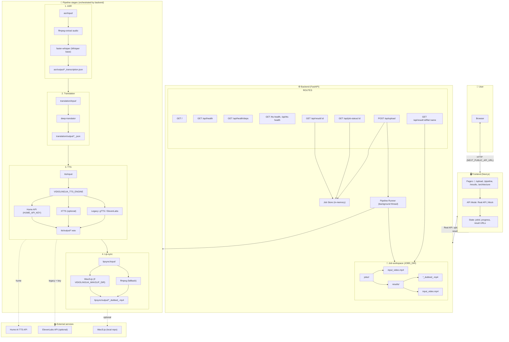
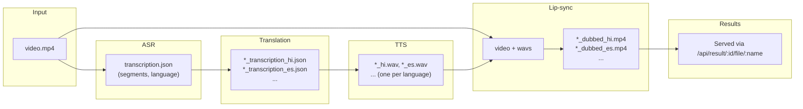
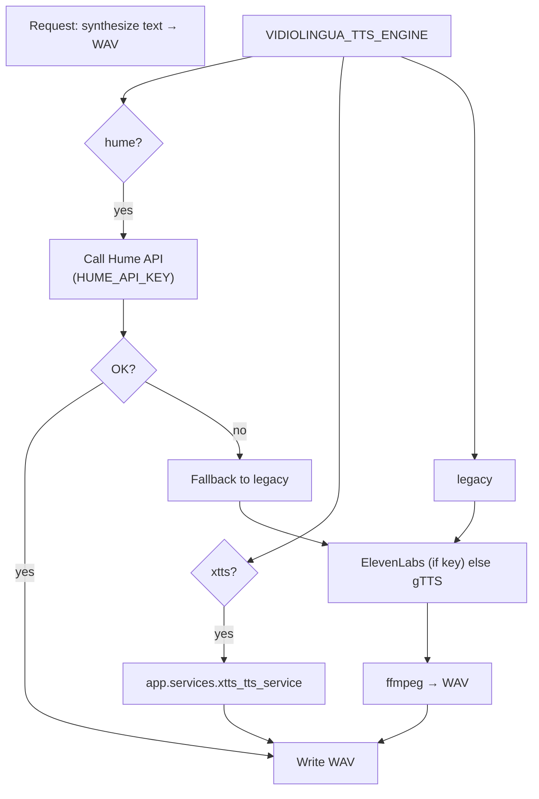
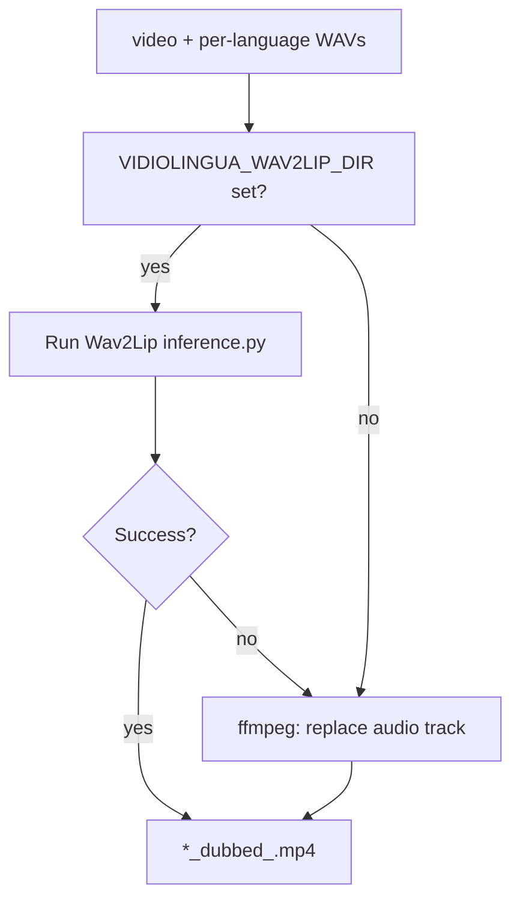
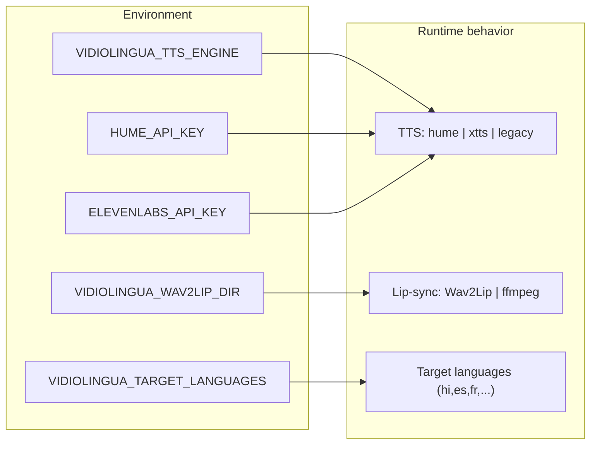

# VidioLingua — System Architecture

For a **one-page diagram for export** (PNG/SVG), see [SYSTEM_ARCHITECTURE_EXPORT.md](SYSTEM_ARCHITECTURE_EXPORT.md).

## Full system architecture (high-level + pipeline + data flow)

---

## Pipeline data flow (artifacts)

---

## TTS engine selection & fallback

---

## Lip-sync path (Wav2Lip vs ffmpeg)

---

## Component stack (summary)

| Layer        | Technology / component |
|-------------|-------------------------|
| Frontend    | Next.js 14, React       |
| Backend     | FastAPI, Uvicorn        |
| ASR         | faster-whisper (Whisper), ffmpeg |
| Translation | deep-translator        |
| TTS         | Hume API, XTTS (opt), gTTS, ElevenLabs |
| Lip-sync    | Wav2Lip (opt), ffmpeg   |
| Storage     | In-memory job store, filesystem (jobs/) |

---

## Environment-driven behavior

---

*Generated for VidioLingua. Render these Mermaid blocks in GitHub, GitLab, or any Mermaid-compatible viewer.*
